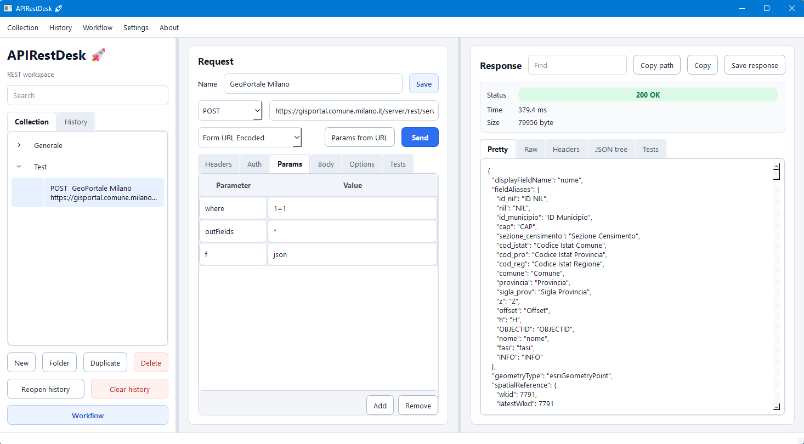
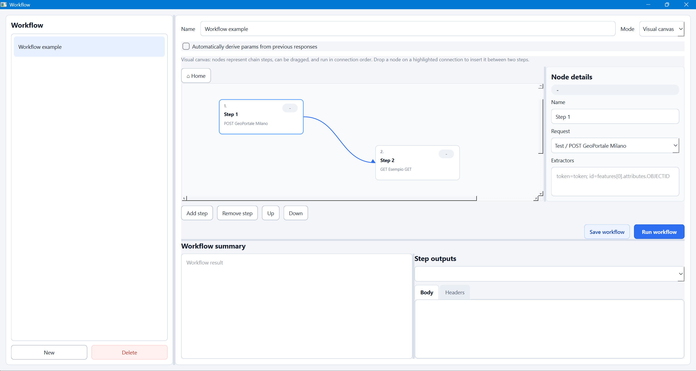

# APIRestDesk

APIRestDesk is a PyQt6 desktop REST client for collecting, testing, saving, and composing REST calls. It is designed as a lightweight tool with local persistence, request history, authentication helpers, and visual workflow composition.

Current version: **1.0.0**

## Screenshots

### Main Window



### Workflow Composer



## Highlights

- Local REST request collection organized in folders.
- Persistent request history.
- HTTP methods: `GET`, `POST`, `PUT`, `PATCH`, `DELETE`.
- Async HTTP execution with `httpx`, keeping the GUI responsive.
- Request editor for URL, headers, params, auth, and body.
- Suggested common HTTP headers.
- Auth modes: no auth, Basic Auth, Bearer Token, API Key in header or query string.
- Query params editor with key/value rows.
- Body modes: `Raw`, `JSON`, `Form URL Encoded`.
- Per-request options for timeout, redirect following, and HTTP status retries.
- Optional session cookies shared across requests.
- Response tests/assertions for status, time, headers, body text, and JSON paths.
- Import OpenAPI JSON documents as request collections.
- Import from cURL and copy the current request as cURL.
- Workspace import/export including collection, folders, history, workflows, and settings.
- Environment variables for reusable `{{variable}}` placeholders.
- JSON formatting with built-in validation.
- Response viewer with `Pretty`, `Raw`, `Headers`, JSON tree, tests, search, copy, and save.
- Status badges and colors for HTTP results.
- Toast notifications in the top-right corner.
- Light and dark themes.
- Italian/English language setting.
- `About` menu with the application version.

## Workflow Composer

The workflow composer chains saved REST calls. Each step executes a saved request and can extract values from its JSON response for use in following steps.

Available workflow modes:

- **Linear**: table-based step editor.
- **Visual canvas**: draggable nodes with connections.

The workflow window can be maximized. The result area has a vertical splitter, so the lower output panel can be resized. After a workflow run, APIRestDesk shows:

- a workflow summary with extracted variables, status codes, timings, and response sizes;
- each step's response body and headers;
- status badges on blocks or canvas nodes.

### Extracting Values From JSON

In the `Extractors` field, use:

```text
variable_name=json.path
```

Example response:

```json
{
  "token": "ABC123",
  "features": [
    {
      "attributes": {
        "OBJECTID": 10
      }
    }
  ]
}
```

Extractors:

```text
token=token; object_id=features[0].attributes.OBJECTID
```

Following steps can use those variables with:

```text
{{token}}
{{object_id}}
```

Examples:

```text
Authorization: Bearer {{token}}
```

```text
token={{token}}
```

```text
where=OBJECTID={{object_id}}
```

Do not write `{{token}}` inside the `Extractors` field. Curly-brace variables are used only when consuming an extracted value in later steps.

### Automatic Parameter Mapping

In a workflow, enable `Automatically derive params from previous responses` to fill blank query parameters in following steps from JSON fields returned by earlier steps. APIRestDesk first tries an exact name match, then a similarity score for common variants such as `userId`, `user_id`, and `user-id`.

Automatic mapping does not overwrite non-empty parameter values. Manually configured extractors still have priority for explicit `{{variable}}` usage.

## Local Data Files

Data is stored as JSON files in the project root:

- `rest_client_collection.json`: saved request collection.
- `rest_client_folders.json`: collection folders.
- `rest_client_history.json`: request history.
- `rest_client_workflows.json`: saved workflows.
- `rest_client_settings.json`: language, theme, and settings.
- `rest_client_cookies.json`: optional session cookie jar.

The history limit is configured in `api_rest_desk/config.py`:

```python
HISTORY_LIMIT = 250
```

## Installation

Requirements:

- Python 3.11 or newer.
- Windows, Linux, or macOS with PyQt6 support.

Install runtime dependencies:

```powershell
.\.venv\Scripts\python.exe -m pip install -r requirements.txt
```

Install the project in editable mode:

```powershell
.\.venv\Scripts\python.exe -m pip install -e .
```

## Running

Direct launcher:

```powershell
.\.venv\Scripts\python.exe launch_api_rest_desk.py
```

Python module:

```powershell
.\.venv\Scripts\python.exe -m api_rest_desk
```

Installed entry point:

```powershell
.\.venv\Scripts\api-rest-desk.exe
```

## Packaging

The project includes a `pyproject.toml` with:

- package name: `api-rest-desk`
- version: `1.0.0`
- dependencies: `PyQt6`, `httpx`
- entry point: `api-rest-desk = api_rest_desk.__main__:main`

Build a Python distribution:

```powershell
.\.venv\Scripts\python.exe -m pip install build
.\.venv\Scripts\python.exe -m build
```

## Project Structure

```text
api_rest_desk/
  __main__.py              Package entry point
  config.py                App constants, version, data file paths
  http_client.py           httpx-based HTTP wrapper
  i18n.py                  Italian/English translations
  main_window.py           Main PyQt6 window
  models.py                Dataclasses for requests, history, workflows
  settings.py              Settings persistence
  settings_dialog.py       Settings dialog
  storage.py               Local JSON read/write helpers
  theme.py                 Light/dark theme and status badges
  toast.py                 Animated toast notifications
  widgets.py               Reusable widgets: headers, auth, key/value
  workers.py               Qt workers for HTTP and workflow execution
  workflow.py              Workflow engine, templating, JSON path extraction
  workflow_canvas.py       Visual workflow canvas
  workflow_dialog.py       Workflow composer
```

Root files:

```text
launch_api_rest_desk.py    Desktop launcher
pyproject.toml             Python packaging metadata
requirements.txt           Runtime dependencies
README.md                  Documentation
```

## Technical Notes

- HTTP requests run in Qt worker threads.
- History stores request headers, params, body, request options, assertions, status, response headers, and response body.
- Auth credentials are stored in the local request collection.
- History entries do not restore auth credentials, to avoid duplicating tokens/passwords.
- Session cookies are stored only when a request has the session-cookie option enabled.
- Workflows reference saved collection requests. If a request changes, workflow steps use the updated request.
- The `{{variable}}` template is applied to URLs, headers, body, params, and auth fields.
- Extractors read JSON responses with paths such as `token`, `data.access_token`, `features[0].attributes.OBJECTID`.
- Retries are evaluated on configured HTTP statuses such as `429`, `500`, `502`, `503`, and `504`.
- cURL import currently supports the common request options: URL, method, headers, raw data, Basic Auth, redirects, and timeout.
- OpenAPI import currently supports JSON documents, OpenAPI 3 `servers`, Swagger 2 `host/basePath`, paths, methods, query/header parameters, and basic JSON/form request body examples.

## Response Tests

The request `Tests` tab supports one assertion per line:

```text
status == 200
time < 1000
body contains success
header Content-Type contains json
json token exists
json data.items[0].id == 10
```

Assertions run after the response arrives. Results are shown in the response `Tests` tab and saved in history.

## Disclaimer

The software is distributed on an "AS IS" BASIS, WITHOUT WARRANTIES OR CONDITIONS OF ANY KIND, either express or implied.
